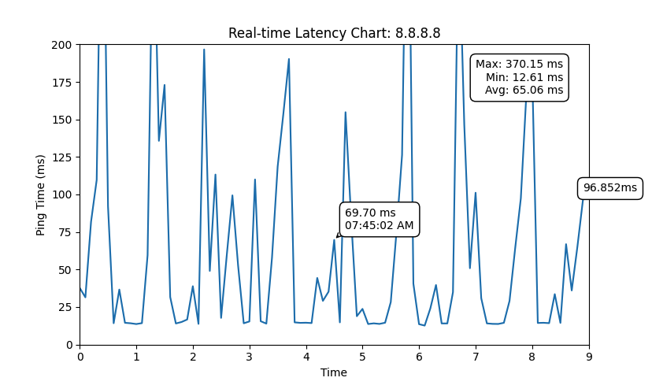

# Real-Time Ping Latency Plot

This Python script continuously pings a specified target and visualizes the real-time latency in a chart using Matplotlib. It displays the min, max, and average ping times as well as annotates any ping times that exceed 100ms.



## Requirements

- Python 3.x
- Matplotlib

You can install the required packages using pip:

```bash
pip install matplotlib
```

## Usage

To run the script, use the following command:

```bash
python3 script_name.py <ping_target>
```

Replace <ping_target> with the IP address or domain name you want to ping, for example:

```bash
python3 script_name.py google.com
```

## Feature

- Real-Time Plotting: The script displays the latency of each ping in real-time.
- Statistics: It calculates and displays the minimum, maximum, and average ping times.
- Annotation: The script automatically labels the latest ping time and highlights any ping times that exceed 100ms.
- Customizable Plot: You can adjust the y-limit in the script to accommodate different ping ranges.

## License
This project is licensed under the MIT License.